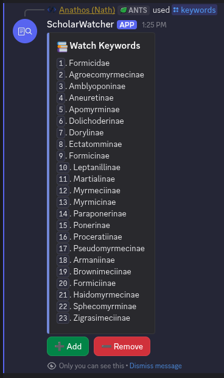
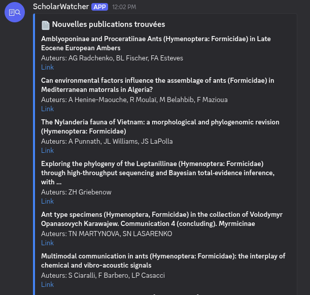

# ScholarWatchForDiscord

> Automated bibliographic monitoring bot for Discord — track new scientific publications across any field.

[](https://nodejs.org/)
[](LICENSE)

## Overview

ScholarWatchForDiscord monitors Google Scholar for new publications matching your keywords and delivers them as Discord notifications. Each server configures its own keywords, schedule, and notification channel. The bot works for any research domain, from myrmecology to astrophysics.

## Features

- **Generic** : no hardcoded domain, everything is driven by keywords
- **Multi-server** : each server has its own configuration
- **Bilingual** : English by default, French available per server
- **Deduplication** : articles are tracked to avoid repeat notifications
- **Customizable schedule** : daily hour or full cron expression
- **Docker deployment** : one command to run

## Installation

### Prerequisites

- [Docker](https://docs.docker.com/get-docker/) and Docker Compose
- A [Discord bot token](https://discord.com/developers/applications)
- A [SerpApi key](https://serpapi.com/)

### Quick start

1. Clone the repository:
   ```bash
   git clone https://github.com/EAnathos/scholarWatchForDiscord.git
   cd scholarwatchfordiscord
   ```

2. Create a `.env` file from the example:
   ```bash
   cp .env.example .env
   ```

3. Fill in your credentials in `.env`:
   ```env
   DISCORD_TOKEN=your_discord_bot_token
   DISCORD_APP_ID=your_discord_application_id
   ENCRYPTION_KEY=your_64_char_hex_key    # openssl rand -hex 32
   DATABASE_URL=postgresql://bot:bot@db:5432/scholarwatch
   LOG_LEVEL=info
   ```

4. Start the bot:
   ```bash
   docker compose up -d --build
   ```

5. Register slash commands:
   ```bash
   docker compose exec bot node dist/discord/deploy.js
   ```
   Global commands can take up to 1 hour to appear. For instant registration on a single server:
   ```bash
   docker compose exec bot node dist/discord/deploy.js --guild=YOUR_GUILD_ID
   ```

### Bot invitation

Invite the bot with these scopes and permissions:
- **Scopes:** `bot`, `applications.commands`
- **Permissions:** `Send Messages`, `Embed Links`, `Use External Emojis`

## Commands

| Command | Description |
|---|---|
| `/keywords` | View and manage watch keywords (add/remove via buttons) |
| `/watch channel <#channel>` | Set the notification channel |
| `/watch schedule hour <0-23>` | Set daily check time (UTC) |
| `/watch schedule cron <expr>` | Set a custom cron schedule |
| `/watch language <en\|fr>` | Change bot language for this server |
| `/watch toggle` | Enable/disable the watch |
| `/watch status` | Show current configuration |
| `/watch apikey set` | Set your SerpApi API key (via modal) |
| `/watch apikey usage` | Show SerpApi usage stats |
| `/watch run` | Force an immediate check (admin only) |

## Usage

### Managing keywords

Use `/keywords` to view, add, or remove watch keywords for your server.



### Notifications

When new publications are found, the bot posts them in your configured channel.



## License

[MIT](LICENSE)
